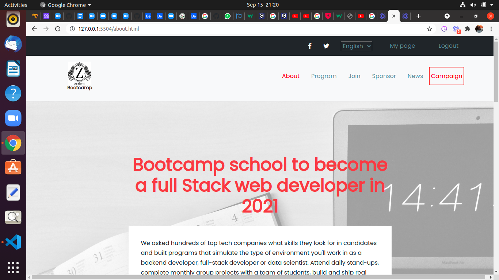

# Zenith-Bootcamp
>
This project displays a full website of a bootcamp school. This was built with Html, Css,Java script,Vscode,Git and Github. 

## Built With

- Html
- Css
- Java Script

## Live Demo

[Live Demo Link](https://chukwuebukavictor.github.io/Zenith-Bootcamp/)

[Loom Video Link](https://www.loom.com/share/ce13b86e94284ed08e6ca391147dea40)

## Getting Started

**This is an example of how you may give instructions on setting up your project locally.**
**Modify this file to match your project, remove sections that don't apply. For example: delete the testing section if the currect project doesn't require testing.**

To get a local copy up and running follow these simple example steps.

### Prerequisites
    - VS Code
    -Github

### Setup
   - git clone your repo
   - cd into the folder
   - open index.html with live server

### Install
    VS Code

### Usage
    This is a project that displays a website of a bootcamp school.

## Authors

👤 **Chukwuebuka Victor Ozoede**

- GitHub: [@chukwuebukaVictor](https://github.com/chukwuebukaVictor)
- Twitter: [@OzoedeVictor](https://twitter.com/OzoedeVictor)
- LinkedIn: [LinkedIn](www.linkedin.com/in/chukwuebuka-ozoede-46616a219)

## 🤝 Contributing

Contributions, issues, and feature requests are welcome!

Feel free to check the [issues page](https://).

## Show your support

Give a ⭐️ if you like this project!

## 📝 License

This project is [MIT](./MIT.md) licensed.